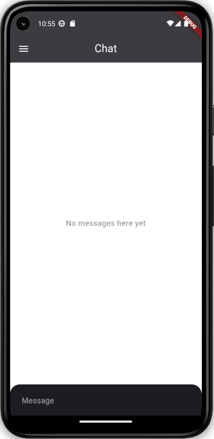
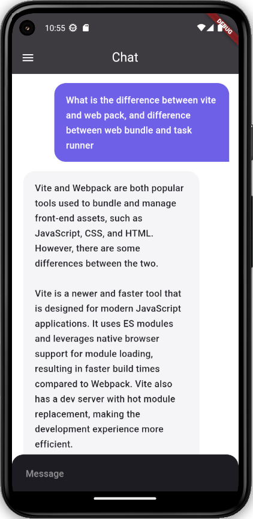
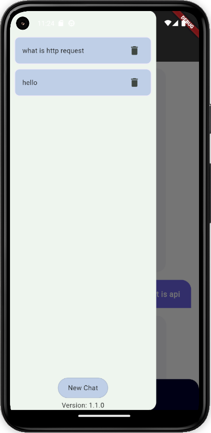
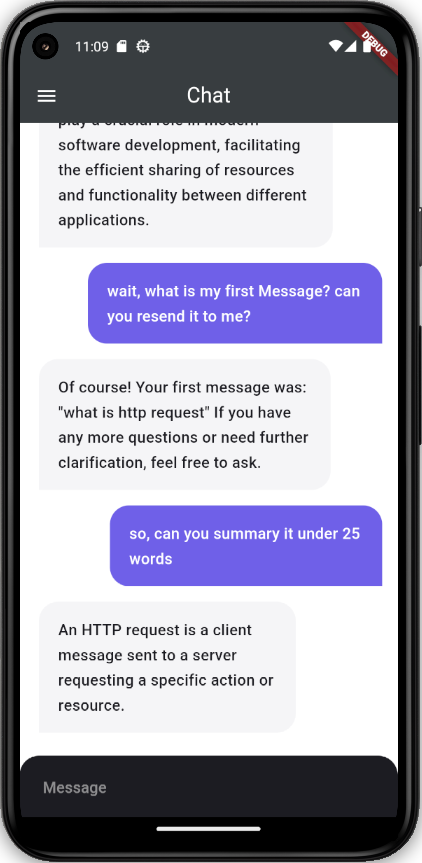

# Flutter Chat AI

Flutter Chat AI is a minor Project to create a mobile app to represent ChatGPT, using OpenAI API

## Installation

Clone the repository:

```bash
git clone https://github.com/Erel0251/FlutterChatAI.git
```

Add Packages:

```bash
flutter pub add
```

## Usage

- create api key at [open API key](https://platform.openai.com/api-keys)
- create file `.env` on root repository
- add `OPEN_AI_API_KEY=sk-<Your api key>`
- run your flutter app an it will show main chat screen
    

## Images

- [x] Normal chat & reponse
    
- [x] Stored multiple chats
    
- [x] Remember conversation
    

## Contributing

Pull requests are welcome. For major changes, please open an issue first
to discuss what you would like to change.

Please make sure to update tests as appropriate.

## License

[MIT](https://choosealicense.com/licenses/mit/)